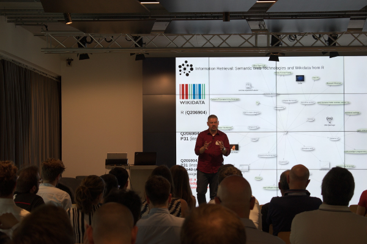

# e-Rum2020_SemanticWeb
e-Rum 2020 Workshop: Semantic Web in R for Data Scientists

This workshop will offer a hands-on approach to Semantic Web technologies in R by exemplifying how to work with Wikidata and DBpedia in different ways. Attendees of the workshop should be R developers who understand the typical ways of dealing with familiar data structures like dataframes and lists. The workshop will be supported by a well documented, readable code in a dedicated GitHub repo. 

The plan is to start simple (using the WIkidata API, for example) and then slowly progress towards more advanced topics (e.g. your first SPARQL query from R and why it is not as complicated as people think, matching your data set against Wikidata entities in order to enrich it, and similar). I will provide an introduction to Semantic Web on a conceptual level only so that participants will not need a full understanding of the related technical standards (RDF, different serializations, etc) to follow through. 

Finally, we will show how to process the Wikidata JSON dump from R for those interested to play big games with R and the Semantic Web. We might be playing around with some interactive graph visualizations during the workshop. I think that Semantic Web is a new topic for many Data Scientist and that the R world definitely deserves a better introduction to it than it already has. 
